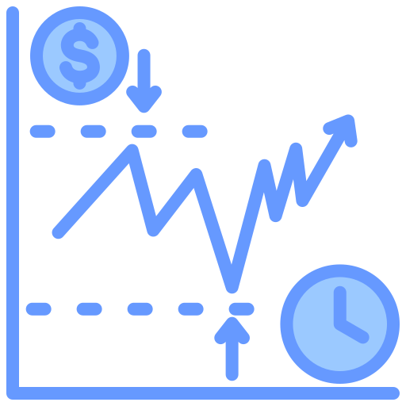

<!-- PROJECT LOGO -->

    

    <h3 style="text-align: center">Signup Form</h3>
    
 
        For Monisma, a mock digital wealth management platform
    

## Built With

-    
-    
- 

 

## Features

- Built using **modern Javascript** practices
- **Responsive design** for desktop & mobile

 

## What I learned

* Form handling with **Javascript**
* Cross-browser Compatibility 
* Animation with **Javascript** for better UX
* Effective Design with color theory for better UI

<!-- ACKNOWLEDGMENTS -->
## Acknowledgments

* [The Odin Project](https://www.theodinproject.com/)
* [Storyset](https://storyset.com/illustration/top-up-credit/bro)
* [Flaticon](https://www.flaticon.com/free-icon/tap_181838)
* [Abdul Khalid](https://github.com/0xabdulkhalid/basket-sign-up/tree/main)

 